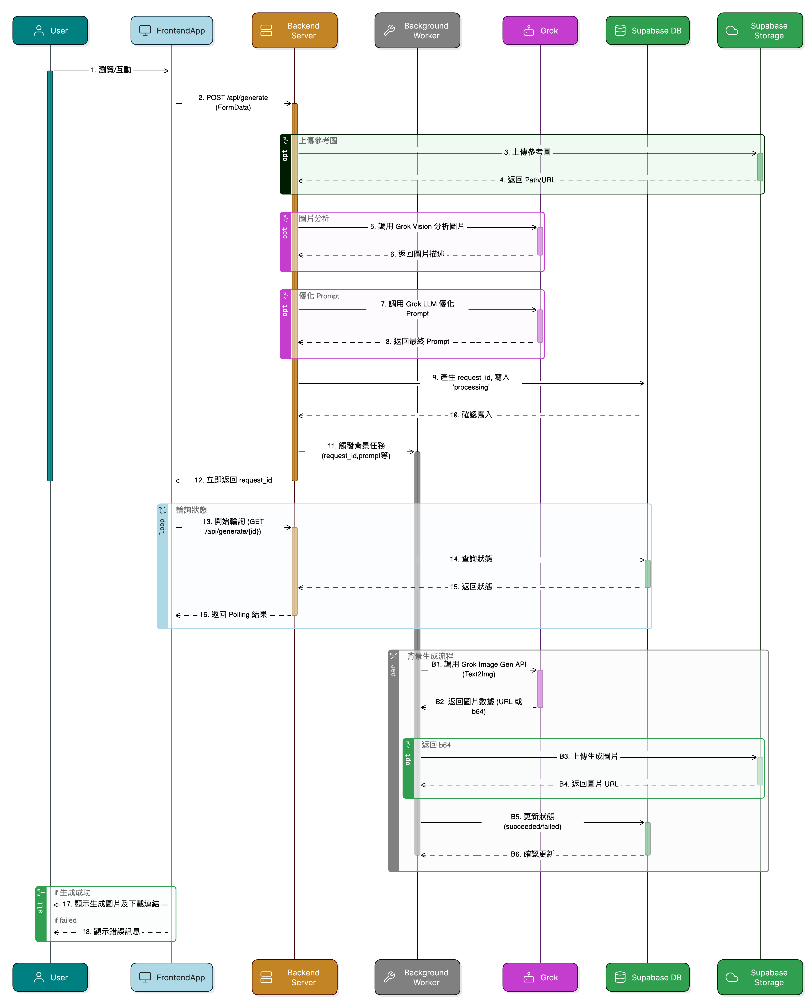

# Cooler Master AI 設計平台 (GenAI Hackathon 專案)

## 📝 專案簡介

本專案旨在響應 Cooler Master 於「2025 雲湧智生：臺灣生成式 AI 應用黑客松競賽」提出的「Cooler Master 智造工坊」命題。目標是開發一個 AI 驅動的設計輔助平台，旨在加速 Cooler Master (特別是 PC 機殼產品) 的早期設計概念發想流程，建立並利用其獨特的產品設計 DNA，提高設計效率與創新性，同時確保品牌風格的一致性。

平台允許設計師透過文字描述、選擇關鍵設計特徵（風格、顏色、燈效等）以及上傳參考圖片或草圖作為輸入，利用 AI 模型（Amazon Bedrock）生成新的設計概念圖。平台也支持設計師對結果進行迭代（例如基於某張圖片再次生成）和提供反饋。

## 🎬 Demo 影片


## ✨ 主要功能 (MVP 及規劃)

* **AI 圖像生成:**
    * 支援**文字轉圖片 (Text-to-Image)**：根據文字描述和特徵生成設計。
    * 支援**圖片轉圖片 (Image-to-Image)**：允許上傳參考圖/草圖 [cite: 4]，結合文字描述進行修改或風格轉換。
    * 支援**設計特徵輸入:** 可選擇風格、主要顏色、燈效等關鍵參數。
    * **Prompt 輔助:** 前端提供關鍵字標籤點選，輔助設計師構建 Prompt。
* **異步處理與結果查詢:** 生成請求提交後立即返回任務 ID，前端透過輪詢 (Polling) 獲取最終的圖片結果。
* **結果展示與反饋:** 在前端展示生成的圖片，並允許使用者提交評價（👍/👎）。
* **(規劃中) 設計 DNA 資料庫:**
    * 收集和標記 Cooler Master 產品的設計特徵（風格、顏色、燈效、材質、關鍵字等）[cite: 3]。 (MVP 階段手動標記)
    * 提供前端頁面供設計師瀏覽和參考 DNA 資料庫內容。
    * 將 DNA 特徵整合進 Prompt Engine，引導 AI 生成更符合品牌風格的結果 [cite: 4]。

## 🛠️ 技術棧 (Tech Stack)

* **前端 (Frontend):**
    * 框架: React + TypeScript
    * 建構工具: Vite
    * UI 庫: Shadcn/ui (基於 Radix UI & Tailwind CSS)
    * HTTP 客戶端: Fetch API (瀏覽器內建)
    * 狀態管理: React Hooks (`useState`, `useRef`, `useEffect`, `useCallback`)
* **後端 (Backend):**
    * 框架: Python + Flask
    * API 文件: Flasgger (整合 Swagger UI)
    * AWS SDK: Boto3
    * 環境變數管理: python-dotenv
* **雲端服務 (AWS):**
    * **API 閘道:** Amazon API Gateway (接收前端請求，觸發 Lambda)
    * **運算:** AWS Lambda (運行 Flask 後端應用邏輯)
    * **AI - Prompt 工程:** Amazon Bedrock (使用 Claude 等 LLM)
    * **AI - 圖像生成:** Amazon SageMaker JumpStart (部署 Stable Diffusion XL 等模型，提供 Endpoint)
    * **儲存:** Amazon S3 (儲存使用者上傳的參考圖和 AI 生成的結果圖)
    * **資料庫:** Amazon DynamoDB (儲存異步任務狀態、使用者反饋、設計 DNA 資料)

## 🏗️ 系統架構概觀

本應用採用前後端分離架構，並利用 AWS 雲服務實現 AI 功能和異步處理：

1.  **前端 (React/TSX)** 負責使用者互動、收集輸入並透過 **API Gateway** 發送請求。
2.  **API Gateway** 將請求路由到 **AWS Lambda** 中運行的 **Flask** 後端應用。
3.  對於生成請求 (`POST /api/generate`)：
    * Flask 應用驗證輸入，(可選)將上傳圖片存至 **S3**。
    * 調用 **Bedrock** (LLM) 服務生成優化的 Prompt。
    * 產生 `request_id`，在 **DynamoDB** 中記錄任務初始狀態 (`processing`)。
    * 觸發一個**背景任務**（在 Lambda 中用 Threading 模擬，或用 SQS/Lambda 實現）。
    * **立即**返回 `request_id` 給前端。
4.  **背景任務** 執行：
    * 調用 **SageMaker Endpoint** 執行圖像生成（Text2Img 或 Img2Img）。
    * 將生成的圖片存儲到 **S3**。
    * 更新 **DynamoDB** 中的任務狀態為 `succeeded` (含圖片 URL) 或 `failed` (含錯誤訊息)。
5.  **前端** 使用 `request_id` **輪詢** `GET /api/generate/{id}` 端點。
6.  Flask 應用查詢 **DynamoDB** 返回任務狀態，直到 `succeeded` 或 `failed`。
7.  前端獲取結果 URL 並顯示圖片。
8.  對於反饋請求 (`POST /api/feedback`)，Flask 應用直接將數據寫入 **DynamoDB**。

(可以參考之前生成的 Mermaid 圖表，將其圖片嵌入或連結於此)

## 📁 專案結構

```
.
├── .gitignore
├── README.md
├── requirements.txt # (合併前後端，或各自有)
├── .env.example     # 環境變數範本
│
├── backend/         # 後端 Flask 應用
│   ├── main.py
│   ├── requirements.txt
│   ├── .env.example
│   └── app/
│       ├── __init__.py
│       ├── config.py
│       ├── routes/      # API 路由 (generate.py, feedback.py, dna.py)
│       ├── services/    # 核心邏輯 (prompt_engine.py, sagemaker_client.py)
│       ├── db/          # 資料庫/儲存互動 (dynamo.py, s3.py)
│       └── utils/       # 工具函數 (logger.py)
│
├── frontend/        # 前端 React 應用
│   ├── public/
│   ├── src/
│   │   ├── components/  # UI 元件 (design/, ui/, etc.)
│   │   ├── hooks/       # 自訂 Hooks (e.g., useToast)
│   │   ├── pages/       # 頁面元件 (DnaDatabasePage.tsx)
│   │   ├── lib/         # 工具函數 (e.g., utils.ts from shadcn)
│   │   ├── App.tsx      # 主應用/路由
│   │   └── main.tsx     # 應用入口
│   ├── index.html
│   ├── package.json
│   ├── vite.config.ts
│   └── tailwind.config.js
│
└── scripts/         # 輔助腳本
    ├── load_db.py
    └── cases_data.csv
```

## ⚙️ 設定與安裝

**後端 (Backend):**

1.  `cd backend`
2.  `python -m venv venv` (建立虛擬環境)
3.  `source venv/bin/activate` (macOS/Linux) 或 `.\venv\Scripts\activate` (Windows) (啟用虛擬環境)
4.  `pip install -r requirements.txt` (安裝依賴)
5.  複製 `.env.example` 為 `.env` (`cp .env.example .env`)
6.  編輯 `.env` 檔案。

**前端 (Frontend):**

1.  `cd frontend`
2.  `npm install` (或 `yarn install`) (安裝依賴)
3.  複製 `.env.example` (如果有的話) 為 `.env.local`
4.  編輯 `.env.local` 檔案，設定 `VITE_BACKEND_API_URL` 指向你的後端地址 (例如 `http://127.0.0.1:8000`)。

## ▶️ 本地運行

1.  **啟動後端:**
    * 開啟一個終端機。
    * `cd backend`
    * `source venv/bin/activate` (或 Windows 的 activate)
    * `python main.py`
    * 後端預設運行在 `http://127.0.0.1:8000`，API 文件在 `http://127.0.0.1:8000/docs/`。

2.  **啟動前端:**
    * 開啟**另一個**終端機。
    * `cd frontend`
    * `npm run dev` (或 `yarn dev`)
    * 前端預設運行在 `http://localhost:8080` (或其他 Vite 指定的端口)。
    * 在瀏覽器中打開前端地址即可開始使用。
  


## 後端重建 (Backend Rebuild - v2 )

主要目標：
* 使用grok生成圖片，資料存在supabase + 背景 Worker 模式。
* 引入身份驗證 (Admin/Demo 模式)。
* 使用 Celery 處理背景圖片生成任務。
* 整合 Flasgger 提供 API 文件。

目前的狀態：
* 後端伺服器已可運行。
* API 文件可在 /apidocs/ 查看。

## v2 專案目錄：
```
.
├── .gitignore                     # 指定 Git 忽略追蹤的文件和目錄 (例如 .env, node_modules, __pycache__)
├── README.md                      # 專案說明文件 (如何安裝、啟動、部署等)
├── docker-compose.yml             # (可選) 使用 Docker Compose 統一部署/開發環境 (後端, Worker, Redis 隊列等)
│
├── backend/                       # 後端應用 (例如 Flask 或 FastAPI) - 處理 API 請求、業務邏輯、身份驗證/授權
│   ├── run.py                     # 啟動後端伺服器的腳本 (例如 `flask run` 或 `uvicorn main:app`)
│   ├── requirements.txt           # 後端 Python 依賴庫列表
│   ├── .env.example               # 後端環境變數範本 (Supabase URL/Key, Grok API Key, JWT Secret, Admin Role ID, Redis URL 等)
│   └── app/                       # Flask/FastAPI 應用程式碼
│       ├── __init__.py            # 將 app 目錄標記為 Python 包，可包含 Flask app factory
│       ├── config.py              # 加載和管理應用配置 (從 .env 讀取)
│       ├── routes/                # API 路由定義
│       │   ├── __init__.py
│       │   └── generate.py        # 處理 /api/generate 相關路由 (POST 和 GET /{id})
│       ├── services/              # 核心業務邏輯
│       │   ├── __init__.py
│       │   ├── generation.py      # 處理生成請求的核心邏輯 (調用 Grok Vision/LLM, 觸發 Worker)
│       │   ├── auth.py            # 處理 JWT 驗證、角色檢查邏輯
│       │   ├── task.py            # 封裝將任務發送到背景隊列 (Redis/Celery) 的邏輯
│       │   └── grok.py            # 封裝調用 Grok API (Vision, LLM) 的客戶端邏輯
│       ├── db/                    # 數據庫和存儲交互 (Supabase)
│       │   ├── __init__.py
│       │   └── supabase_client.py # 初始化 Supabase 客戶端，提供 DB 和 Storage 的交互函數
│       ├── middleware/            # 中間件
│       │   ├── __init__.py
│       │   └── auth_middleware.py # 執行 JWT 身份驗證和 Admin 角色授權檢查
│       ├── models/                # (可選) 定義數據模型/結構 (例如 Pydantic schemas)
│       └── utils/                 # 通用工具函數 (例如 logger.py)
│
├── frontend/                      # 前端應用 (例如 React/Vite) - 用戶界面、狀態管理、與後端 API 交互
│   ├── public/                    # 靜態資源 (例如 index.html, favicons)
│   │   └── images/                # 存放 Demo 模式使用的佔位符圖片 (e.g., demo-placeholder.jpg)
│   ├── src/                       # React 應用源碼
│   │   ├── components/            # 可重用 UI 元件 (例如 Button, Card, Input)
│   │   │   └── specific/          # 特定頁面或功能的元件 (e.g., GenerationForm, ImageResultDisplay)
│   │   │   └── ui/                # 基礎 UI 庫元件 (e.g., from shadcn/ui)
│   │   │   └── DemoBanner.tsx     # (新增) 用於顯示 "Demo Mode" 的橫幅
│   │   ├── contexts/              # (或 store/) React Context 或其他狀態管理
│   │   │   └── AuthContext.tsx    # (新增) 管理用戶認證狀態 (isAuthenticated) 和角色 (isAdmin)
│   │   ├── hooks/                 # 自定義 React Hooks
│   │   │   └── useAuth.ts         # (新增) 封裝讀取 AuthContext 狀態的邏輯
│   │   ├── pages/                 # 頁面級元件
│   │   │   └── GeneratePage.tsx   # 主要的圖片生成頁面
│   │   │   └── LoginPage.tsx      # (新增) 用戶登錄頁面
│   │   ├── services/              # 封裝與外部交互的邏輯
│   │   │   ├── api.ts             # 調用真實後端 API 的函數
│   │   │   ├── mockApi.ts         # (新增) 模擬後端 API 行為的函數 (用於 Demo Mode)
│   │   │   └── supabase.ts        # 初始化 Supabase 前端客戶端 (主要用於 Auth)
│   │   ├── lib/                   # 通用工具函數 (例如 utils.ts)
│   │   ├── App.tsx                # 主應用組件，包含路由設置、全局佈局、狀態提供者
│   │   └── main.tsx               # 應用入口點，渲染 App 元件
│   ├── index.html                 # Vite 入口 HTML
│   ├── package.json               # 前端項目依賴和腳本
│   ├── vite.config.ts             # Vite 配置文件
│   ├── tailwind.config.js         # Tailwind CSS 配置文件
│   └── .env.example               # 前端環境變數範本 (VITE_SUPABASE_URL, VITE_SUPABASE_ANON_KEY)
│
├── worker/                        # 背景工作處理器 (例如 Celery 或 RQ) - 執行耗時任務
│   ├── run_worker.sh              # (或 run.py) 啟動 Worker 進程的腳本
│   ├── requirements.txt           # Worker Python 依賴庫列表 (Celery/RQ, Supabase client, Grok client)
│   ├── .env.example               # Worker 環境變數範本 (Supabase URL/Key, Grok API Key, Redis URL)
│   ├── celery_app.py              # (如果使用 Celery) Celery app 實例化和配置
│   └── tasks.py                   # 定義背景任務函數
│       └── generation_task.py     # (例如) 實際執行圖片生成任務的函數:
│                                  #   1. 接收 request_id, prompt 等參數
│                                  #   2. 調用 Grok Image Gen API
│                                  #   3. (可選) 將結果上傳到 Supabase Storage
│                                  #   4. 更新 Supabase DB 中的請求狀態 (succeeded/failed) 和結果 URL
│       └── clients/               # (可選) 如果不使用 shared library，可以在此處放客戶端代碼
│           └── supabase_client.py
│           └── grok_client.py
│
├── shared/                        # (可選但推薦) 後端和 Worker 共用的代碼庫
│   ├── setup.py / pyproject.toml  # 使其成為可安裝的 Python 包
│   └── shared_lib/
│       ├── __init__.py
│       ├── supabase/              # 共用的 Supabase 客戶端邏輯
│       │   └── client.py
│       ├── grok/                  # 共用的 Grok 客戶端邏輯
│       │   └── client.py
│       └── models/                # 共用的數據模型 (例如 Pydantic)
│
└── scripts/                     # 開發或維護用的輔助腳本
    ├── setup_admin.py             # (新增) 用於設置 Supabase 用戶角色的腳本
    ├── load_db.py               # (保留) 可能用於加載初始數據
    └── cases_data.csv           # (保留) 範例數據
```
   

## 循序圖(Sequence Diagram)
可以查看 [Eraser.io](https://app.eraser.io/workspace/PhcYTxWOFxbesc9uRrLT?origin=share)網頁版進行縮放。


